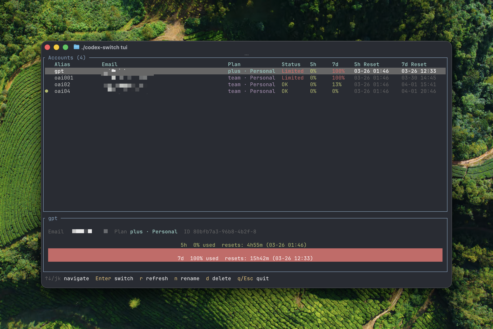

# codex-switch

**[OpenAI Codex CLI](https://github.com/openai/codex) 多账号管理工具** — 保存本机 Codex 登录、监控配额，并在下一次会话前选出最佳账号。

[English README](README.md) · [**完整文档（Wiki）**](https://github.com/xjoker/codex-switch/wiki) · [中文指南](https://github.com/xjoker/codex-switch/wiki/Chinese-Guide) · [Releases](https://github.com/xjoker/codex-switch/releases)

> `codex-switch` 会在本机保存账号凭据。请勿分享 profile、`auth.json`、Token、代理凭据或未脱敏的 debug 输出。

## 快速开始

Codex 必须使用文件型凭据存储。如有需要，在 `$CODEX_HOME/config.toml`（通常为 `~/.codex/config.toml`）中加入下面一行；受管配置若设置了 `forced_login_method = "api"` 则不兼容：

```toml
cli_auth_credentials_store = "file"
```

安装正式版 — macOS / Linux：

```bash
curl -fsSL https://github.com/xjoker/codex-switch/releases/latest/download/install.sh | bash
```

Windows PowerShell：

```powershell
irm https://github.com/xjoker/codex-switch/releases/latest/download/install.ps1 | iex
```

Homebrew 用户：`brew install xjoker/tap/codex-switch`。

> **注意**：本项目不在 crates.io 分发——请勿 `cargo install codex-switch`，该包名属于另一个无关的同名项目。

然后添加账号并打开仪表盘：

```bash
codex-switch login        # 无浏览器服务器加 --device
codex-switch tui          # 交互式仪表盘
codex-switch use          # 自动切换到最佳账号
codex-switch launch       # 用最佳账号启动 Codex
```



## 功能一览

- 保存、导入、重命名、切换和可恢复地删除 Codex 账号。
- 保存自定义 API 提供方（OpenRouter 等兼容 Responses 协议的接口）：一个端点可配置多个模型，思考等级与 `web_search` 按模型保存；TUI Providers 页用同一张表单新增/编辑（`a` / `e`），`Enter` / `o` 启动 Codex。通过 `launch` 启动，不写入 `~/.codex`：

  ```bash
  codex-switch provider add openrouter \
    --base-url https://openrouter.ai/api/v1 \
    --model openai/gpt-5.3-codex \
    --model deepseek/deepseek-r1-0528 --reasoning medium
  codex-switch launch openrouter
  codex-switch launch openrouter --model deepseek/deepseek-r1-0528
  ```
- CLI 与 TUI 展示主额度池和每个模型的独立额度池。
- 自适应配速感知评分自动选号，并可直接用它启动 Codex。
- 支持重置卡、配额预热、JSON 输出、代理，以及 Beta 后台守护进程（macOS LaunchAgent / Linux systemd / Windows 任务计划程序 Task Scheduler；可调 `cache_refresh_interval_secs` 与 `auto_warmup`）。
- 自动刷新即将过期的 Token；直装版本自更新：`self-update`、`self-update --stable`、`self-update --version <VERSION>`，或用 `self-update --dev` 切换滚动开发通道 — 新装开发版使用 dev release 的 [install.sh](https://github.com/xjoker/codex-switch/releases/download/dev/install.sh) / [install.ps1](https://github.com/xjoker/codex-switch/releases/download/dev/install.ps1)。
- 直装版 `self-update` 同时校验 SHA-256 与 GitHub 构建来源，执行时会调用 `gh attestation verify`；使用前需安装当前版 [GitHub CLI](https://cli.github.com/)。
- 支持 macOS、Linux、Windows。

> **从 `0.0.x` 旧版本升级？** 本轮发布刻意做了两个破坏性变更：版本号改为日历格式（`YYYYMMDD.N.0`，一眼可读版本分配日期且仍按 SemVer 正常排序升级），macOS/Linux 安装位置从 `/usr/local/bin` 改为用户级 `$HOME/.local/bin`（`self-update` 不再需要 `sudo`）。正常 `self-update` 或重跑一次安装脚本即可迁移；账号与配置全部保留。全部破坏性变更及原因见 [Updating](https://github.com/xjoker/codex-switch/wiki/Updating)。

## 文档

**[GitHub Wiki](https://github.com/xjoker/codex-switch/wiki)** 是完整文档：开始使用、功能指南、自定义 API 提供方、命令参考、配置、更新与通道、故障排查、FAQ 以及贡献者指南。中文读者从 [中文指南](https://github.com/xjoker/codex-switch/wiki/Chinese-Guide) 开始；行为细节以英文页面为准。

维护者文档：[发布流程](docs/RELEASE.md) · [更新日志](docs/CHANGELOG.md) · [贡献指南](CONTRIBUTING.md)。

## 许可证

[MIT](LICENSE)
