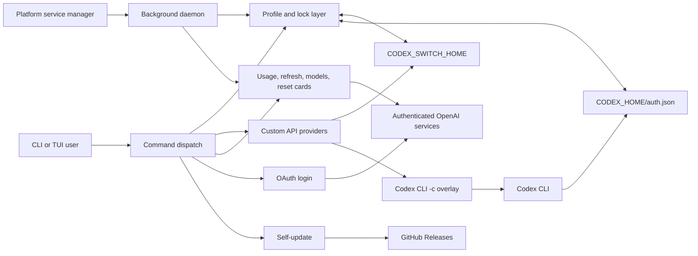

# Architecture overview

`codex-switch` is a single Rust binary. It owns saved profile and custom-provider state under `CODEX_SWITCH_HOME` and coordinates access to the live Codex authentication file under `CODEX_HOME`.

## System boundaries

The application treats local files, command-line input, environment variables, OAuth callbacks, HTTP responses, and release assets as trust boundaries. Internal module calls rely on Rust types and established invariants.

## Startup and command dispatch

[`src/main.rs`](https://github.com/xjoker/codex-switch/blob/dev/src/main.rs) parses the CLI, initializes configuration and logging, chooses human or JSON output behavior, performs interactive live-auth change detection where appropriate, and dispatches to focused command modules under [`src/commands/`](https://github.com/xjoker/codex-switch/tree/dev/src/commands).

Configuration is loaded once from `config.toml`. An existing unreadable or invalid file fails fast with its path; missing configuration uses defaults. CLI proxy configuration has higher priority than file and environment configuration.

## Authentication and profile ownership

[`src/auth.rs`](https://github.com/xjoker/codex-switch/blob/dev/src/auth.rs) resolves `CODEX_HOME`, validates the Codex credential-store contract, reads and atomically writes authentication JSON, rotates live-auth backups, and builds network clients. It does not own profile selection.

[`src/profile.rs`](https://github.com/xjoker/codex-switch/blob/dev/src/profile.rs) owns aliases, identity deduplication, imports, recoverable deletion, current-profile tracking, and switching. Two file locks protect distinct operations:

- `auth.lock` serializes replacement or synchronization of the live `auth.json`.
- `launch.lock` serializes temporary authentication staging performed by `launch`.

Profile identity prefers `account_id` and falls back to email when required for locally authenticated operations. Imports are intentionally create-only: Usage API access proves workspace membership, but a Team workspace ID can belong to several users and cannot authorize overwriting an existing profile. Tokens refreshed while a profile is active are written to both the saved profile and the live auth file under the same switching discipline. A rotated import that loses verifiable identity is written under `recovery/`, outside the selectable profile tree.

## Custom API providers

[`src/provider.rs`](https://github.com/xjoker/codex-switch/blob/dev/src/provider.rs) owns third-party API provider profiles (OpenRouter and other Responses-compatible endpoints). Each profile is a TOML file under `$CODEX_SWITCH_HOME/providers/<alias>/provider.toml` (directory `0700`, file `0600`). It carries a Codex `model_providers.<id>` definition, a bearer key, and a list of models with per-model reasoning / `web_search`; it has no `auth.json`. The alias is the only user-facing name.

[`src/launch.rs`](https://github.com/xjoker/codex-switch/blob/dev/src/launch.rs) takes a separate path when the named alias is a provider: it does not stage `$CODEX_HOME/auth.json`. The profile is translated into `codex -c …` overrides that define and select the provider and a saved model (`--model` or `default_model`), a generated model catalog is written next to `provider.toml`, and the key is injected into the child process environment under `env_key` — never onto the command line. The child's `CODEX_HOME` is `$CODEX_SWITCH_HOME/providers/<alias>/codex-home` so Codex runtime files stay in the switch tree. The user's `~/.codex` is not read or written. Auto-select (`launch` with no alias) and `use` stay ChatGPT-only. Provider launch probes `POST /responses` with only `model` before spawn and refuses a Chat Completions-only slug.

The TUI isolates the two kinds of profile on separate tabs so quota/scoring bindings never mix with provider add/edit/rename/remove. See [Custom API providers](Providers).

## Usage, refresh, and selection

The [`src/usage/`](https://github.com/xjoker/codex-switch/tree/dev/src/usage) module is split by responsibility:

| Module | Responsibility |
|---|---|
| `api.rs` | Authenticated requests, token refresh, retries, and import validation |
| `parse.rs` | Convert service responses into stable quota structures |
| `reset_credits.rs` | Select and consume reset cards |
| `scoring.rs` | Pure eligibility, pace, and candidate scoring functions |
| `mod.rs` | Shared domain types and public module surface |

[`src/cache.rs`](https://github.com/xjoker/codex-switch/blob/dev/src/cache.rs) persists usage and workspace-name data. It also records two negative results, so a known answer is not requested again on every invocation: credentials the auth server has permanently refused, kept until the credential itself is replaced, and accounts confirmed to have no workspace name, kept for a day. `--force` bypasses both, and is the only thing that does: the daemon's periodic refresh takes current usage numbers but leaves a recorded refusal standing, since re-presenting a spent credential on a timer cannot produce a different answer. Cache file updates use an in-process mutex and a cross-process file lock, then replace the file atomically.

Selection has two phases. Eligibility excludes candidates with missing authoritative quota data, exhausted windows, critical weekly state with a distant reset, or an unsafe Free-plan balance. Scoring then combines tier preference, pace-aware headroom, weekly sustainability, expiring quota value, and recency. The shared scoring path is used by both interactive commands and the daemon.

## TUI and output contracts

[`src/tui/`](https://github.com/xjoker/codex-switch/blob/dev/src/tui) separates application state, key bindings, menus, popups, the provider form, and rendering. Network or filesystem actions suspend or update the terminal deliberately rather than running inside rendering functions. Accounts and custom providers occupy separate tabs so quota/scoring keys never mix with provider add/edit/rename/remove.

[`src/output.rs`](https://github.com/xjoker/codex-switch/blob/dev/src/output.rs) owns JSON response types and human formatting. In JSON mode stdout must contain only structured output; human diagnostics and progress are routed to stderr. This separation is part of the automation contract and is covered by integration tests.

## Daemon lifecycle

[`src/daemon/`](https://github.com/xjoker/codex-switch/tree/dev/src/daemon) separates orchestration, polling, process detection, notifications, PID-file ownership, service-manager integration, and persisted state.

The loop uses independent timers for account polling, cache refresh, and token checks. Recoverable failures are exposed through state and bounded backoff. A pending switch is retained while an interactive Codex session is detected and retried later.

Service managers start the binary in foreground mode:

| Platform | Integration |
|---|---|
| macOS | `~/Library/LaunchAgents/com.codex-switch.daemon.plist` |
| Linux | `~/.config/systemd/user/codex-switch-daemon.service` |
| Windows | `codex-switch-daemon` Task Scheduler task |

PID-file cleanup verifies lock ownership before removal. Removing a path while another daemon holds the underlying file lock would create two apparent owners and is forbidden.

## State layout

| Location | Owner and purpose |
|---|---|
| `$CODEX_HOME/auth.json` | Live authentication read by Codex CLI |
| `$CODEX_HOME/config.toml` | Codex configuration, including file-store requirement |
| `$CODEX_SWITCH_HOME/profiles/<alias>/auth.json` | Saved account credentials |
| `$CODEX_SWITCH_HOME/providers/<alias>/provider.toml` | Custom API provider definition and key |
| `$CODEX_SWITCH_HOME/providers/<alias>/models.json` | Generated Codex model catalog for `/model` |
| `$CODEX_SWITCH_HOME/providers/<alias>/codex-home/` | Isolated Codex runtime for a custom provider launch |
| `$CODEX_SWITCH_HOME/current` | Current alias marker |
| `$CODEX_SWITCH_HOME/deleted-profiles/` | Recoverable profile archives |
| `$CODEX_SWITCH_HOME/cache.json` | Usage, workspace metadata, and rejected-credential cache |
| `$CODEX_SWITCH_HOME/config.toml` | Application configuration |
| `$CODEX_SWITCH_HOME/daemon-state.json` | Daemon status and pending-switch snapshot |
| `$CODEX_SWITCH_HOME/logs/` | Rotated diagnostic logs |
| `$CODEX_SWITCH_HOME/*.lock` | Cross-process coordination files |

The defaults are `~/.codex` and `~/.codex-switch`. `CODEX_SWITCH_HOME` never changes where Codex reads its live authentication.

## Release architecture

The branch CI workflow runs tests, Clippy, and debug builds on Linux, macOS, and Windows. Linux also checks formatting, dependency advisories, and shell syntax; Windows parses the PowerShell installer.

Release artifacts are built only by GitHub Actions for six platform/architecture pairs. The workflow injects the tag-derived version, produces archives and checksums, verifies every checksum, and generates a Sigstore build-provenance bundle for the archives before creating the GitHub Release. Direct self-update verifies that bundle against this repository, the release workflow, and the exact tag ref before replacing the binary. Local release builds are diagnostic only and are never the distribution source of truth.

## Next steps

- Set up the repository with [Developer onboarding](Developer-Onboarding).
- Review test and pull-request requirements in [Contributing](Contributing).
- Custom API provider storage and launch overlay: [Custom API providers](Providers).
