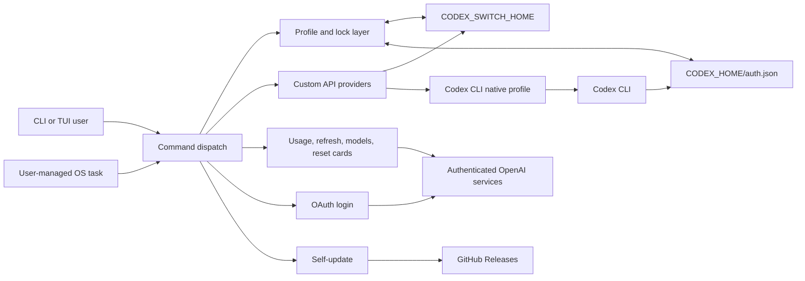

# Architecture overview

`codex-switch` is a single Rust binary. It owns saved profile and custom-provider state under `CODEX_SWITCH_HOME` and coordinates access to the live Codex authentication file under `CODEX_HOME`.

## System boundaries

```mermaid
flowchart LR
    User[CLI or TUI user] --> Dispatch[Command dispatch]
    Scheduler[User-managed OS task] --> Dispatch[Command dispatch]
    Dispatch --> Profiles[Profile and lock layer]
    Dispatch --> Providers[Custom API providers]
    Dispatch --> Usage[Usage, refresh, models, reset cards]
    Dispatch --> Login[OAuth login]
    Dispatch --> Update[Self-update]
    Profiles <--> CSHome[CODEX_SWITCH_HOME]
    Providers --> CSHome
    Providers --> CodexLaunch[Codex CLI native profile]
    Profiles <--> CodexAuth[CODEX_HOME/auth.json]
    Usage --> OpenAI[Authenticated OpenAI services]
    Login --> OpenAI
    Update --> Releases[GitHub Releases]
    Codex[Codex CLI] --> CodexAuth
    CodexLaunch --> Codex
```

The application treats local files, command-line input, environment variables, OAuth callbacks, HTTP responses, and release assets as trust boundaries. Internal module calls rely on Rust types and established invariants.

## Startup and command dispatch

[`src/main.rs`](https://github.com/xjoker/codex-switch/blob/dev/src/main.rs) parses the CLI, initializes configuration and logging, chooses human or JSON output behavior, performs interactive live-auth change detection where appropriate, and dispatches to focused command modules under [`src/commands/`](https://github.com/xjoker/codex-switch/tree/dev/src/commands).

Configuration is loaded once from `config.toml`. An existing unreadable or invalid file fails fast with its path; missing configuration uses defaults. CLI proxy configuration has higher priority than file and environment configuration.

## Authentication and profile ownership

[`src/auth.rs`](https://github.com/xjoker/codex-switch/blob/dev/src/auth.rs) resolves `CODEX_HOME`, validates the Codex credential-store contract, reads and atomically writes authentication JSON, rotates live-auth backups, and builds network clients. It does not own profile selection.

[`src/auth_policy.rs`](https://github.com/xjoker/codex-switch/blob/dev/src/auth_policy.rs) evaluates authentication constraints without editing their sources. Managed defaults and system/macOS MDM requirements are resolved separately so ordinary configuration cannot override requirements. File-backed ChatGPT login and backend requests check the relevant constraints before side effects. Token refresh checks before sending the one-time token; persistence of an already-issued replacement remains a recovery obligation.

[`src/profile.rs`](https://github.com/xjoker/codex-switch/blob/dev/src/profile.rs) owns aliases, identity deduplication, imports, recoverable deletion, current-profile tracking, and switching. Two file locks protect distinct operations:

- `auth.lock` serializes replacement or synchronization of the live `auth.json`.
- `launch.lock` serializes temporary authentication staging performed by `launch`.

Profile identity prefers `account_id` and falls back to email when required for locally authenticated operations. Imports are intentionally create-only: Usage API access proves workspace membership, but a Team workspace ID can belong to several users and cannot authorize overwriting an existing profile. Tokens refreshed while a profile is active are written to both the saved profile and the live auth file under the same switching discipline. A rotated import that loses verifiable identity is written under `recovery/`, outside the selectable profile tree.

[`src/app_server.rs`](https://github.com/xjoker/codex-switch/blob/dev/src/app_server.rs) restarts the Codex app-server daemon after `use` or `login` makes a different account live. Codex 0.157 and newer attaches interactive sessions to that daemon, which loads `auth.json` once and re-reads it only for the account it already holds. Parsed credentials are compared as canonical JSON before and after the change; formatting-only differences skip the restart. `codex app-server daemon version` decides whether a managed daemon is running; only then is `codex app-server daemon restart` run (unless `use.restart_app_server = false`), so a stopped daemon is never started by a switch, and a failed restart is reported without failing the switch. Every daemon call is bounded to 15 seconds, including output collection. `launch` avoids the daemon instead: a ChatGPT launch passes `--no-daemon` when the installed Codex lists it, so the staged file is read by the launched process itself. If the help probe (bounded to 10 seconds) fails, launch stops before staging credentials because daemon routing cannot be established.

## Custom API providers

[`src/provider.rs`](https://github.com/xjoker/codex-switch/blob/dev/src/provider.rs) owns third-party API provider profiles (OpenRouter and other Responses-compatible endpoints). Each profile is a TOML file under `$CODEX_SWITCH_HOME/providers/<alias>/provider.toml` (directory `0700`, file `0600`). It carries a Codex `model_providers.<id>` definition, a bearer key, and a list of models with per-model reasoning / `web_search`; it has no `auth.json`. The alias is the only user-facing name.

[`src/launch.rs`](https://github.com/xjoker/codex-switch/blob/dev/src/launch.rs) takes a separate path when the named alias is a provider: it does not stage `$CODEX_HOME/auth.json`. Each launch selects a native `cs-*.config.toml` profile in the shared Codex home. It defines the runtime provider, saved model and catalog, and injects the key into the child environment under `env_key`. MCP servers, skills, plugins, hooks and sessions remain in the user's Codex home. Concurrent launches have distinct profile names and runtime provider IDs, leaving ChatGPT settings in `config.toml` untouched. Auto-select (`launch` with no alias) and `use` stay ChatGPT-only. Gateway discovery and Responses probing are explicit commands, and saved probe verdicts live for 7 days scoped to a connection fingerprint. Launch performs no gateway I/O except when the chosen model has a saved "unsupported" verdict: it then sends one live probe and refuses only if that probe confirms the denial; a supported answer proceeds and refreshes the record, and an inconclusive answer or network failure proceeds with a stderr warning and drops the record.

Run cleanup holds each run's lease while checking its child and scanning the first metadata record of active and archived JSONL rollouts. An unreadable, truncated, oversized or unknown rollout makes that home's scan incomplete and preserves its recovery profiles. A later launch can retry cleanup after the data becomes readable.

The TUI isolates the two kinds of profile on separate tabs so quota/scoring bindings never mix with provider add/edit/rename/remove. See [Custom API providers](Providers).

Provider privacy and offline diagnostics live in `src/provider/privacy.rs` and `src/provider/diagnostics.rs`. Privacy resolves saved literal headers into per-launch environment references before either native or legacy argv is assembled; inspection uses the same redaction policy in CLI and TUI. Diagnostics read saved model metadata and home-level agent configuration without inference/network calls. Model catalogs carry a `_codex_switch` provenance object alongside Codex's `models` array; native model fields remain intact and older catalogs remain compatible.

## Usage, refresh, and selection

The [`src/usage/`](https://github.com/xjoker/codex-switch/tree/dev/src/usage) module is split by responsibility:

| Module | Responsibility |
|---|---|
| `api.rs` | Authenticated requests, token refresh, retries, and import validation |
| `parse.rs` | Convert service responses into stable quota structures |
| `reset_credits.rs` | Select and consume reset cards |
| `scoring.rs` | Pure eligibility, pace, and candidate scoring functions |
| `mod.rs` | Shared domain types and public module surface |

[`src/cache.rs`](https://github.com/xjoker/codex-switch/blob/dev/src/cache.rs) persists usage and workspace-name data. It also records two negative results, so a known answer is not requested again on every invocation: credentials the auth server has permanently refused, kept until the credential itself is replaced, and accounts confirmed to have no workspace name, kept for a day. `--force` bypasses both, and is the only thing that does: a one-time refresh takes current usage numbers but leaves a recorded refusal standing, since re-presenting a spent credential cannot produce a different answer. Cache file updates use an in-process mutex and a cross-process file lock, then replace the file atomically.

Selection has two phases. Eligibility excludes candidates with missing authoritative quota data, exhausted windows, critical weekly state with a distant reset, or an unsafe Free-plan balance. Scoring then combines tier preference, pace-aware headroom, weekly sustainability, expiring quota value, and recency. The shared scoring path is used by interactive commands and the TUI.

## TUI and output contracts

[`src/tui/`](https://github.com/xjoker/codex-switch/blob/dev/src/tui) separates application state, key bindings, menus, popups, the provider form, and rendering. Network or filesystem actions suspend or update the terminal deliberately rather than running inside rendering functions. Accounts and custom providers occupy separate tabs so quota/scoring keys never mix with provider add/edit/rename/remove.

[`src/output.rs`](https://github.com/xjoker/codex-switch/blob/dev/src/output.rs) owns JSON response types and human formatting. In JSON mode stdout must contain only structured output; human diagnostics and progress are routed to stderr. This separation is part of the automation contract and is covered by integration tests.

## One-shot operations and scheduling boundary

`warmup`, `list --force`, `use`, and `launch` perform one operation and exit. The TUI `w` action warms the selected account once when it has a 5h window, `u` starts a selected-account switch and reports progress in the status line, and `t` enables session-only automatic usage refresh. The project does not contain a resident daemon, PID-file lifecycle, service-manager integration, automatic account switcher, or internal schedule.

If periodic refresh or warmup is desired, a user-managed cron, systemd user timer, Task Scheduler task, or launchd agent may invoke the binary. That scheduler is outside the application and owns its environment, logs, lifecycle, and removal; see [Optional OS scheduling](Feature-Guide#optional-os-scheduling).

## State layout

| Location | Owner and purpose |
|---|---|
| `$CODEX_HOME/auth.json` | Live authentication read by Codex CLI |
| `$CODEX_HOME/config.toml` | Codex configuration, including file-store requirement |
| `$CODEX_SWITCH_HOME/profiles/<alias>/auth.json` | Saved account credentials |
| `$CODEX_SWITCH_HOME/providers/<alias>/provider.toml` | Custom API provider definition and key |
| `$CODEX_SWITCH_HOME/providers/<alias>/models.json` | Generated Codex model catalog for `/model` |
| `$CODEX_SWITCH_HOME/current` | Current alias marker |
| `$CODEX_SWITCH_HOME/deleted-profiles/` | Recoverable profile archives |
| `$CODEX_SWITCH_HOME/cache.json` | Usage, workspace metadata, and rejected-credential cache |
| `$CODEX_SWITCH_HOME/config.toml` | Application configuration |
| `$CODEX_SWITCH_HOME/logs/` | Rotated diagnostic logs |
| `$CODEX_SWITCH_HOME/*.lock` | Cross-process coordination files |

The defaults are `~/.codex` and `~/.codex-switch`. `CODEX_SWITCH_HOME` never changes where Codex reads its live authentication.

## Release architecture

The branch CI workflow runs tests, Clippy, and debug builds on Linux, macOS, and Windows. Linux also checks formatting, dependency advisories, and shell syntax; Windows parses the PowerShell installer.

Release artifacts are built only by GitHub Actions for six platform/architecture pairs. The workflow injects the tag-derived version, produces archives and checksums, verifies every checksum, and generates a Sigstore build-provenance bundle for the archives before creating the GitHub Release. Direct self-update verifies that bundle against this repository, the release workflow, and the exact tag ref before replacing the binary. Local release builds are diagnostic only and are never the distribution source of truth.

## Next steps

- Set up the repository with [Developer onboarding](Developer-Onboarding).
- Review test and pull-request requirements in [Contributing](Contributing).
- Custom API provider storage and launch overlay: [Custom API providers](Providers).
